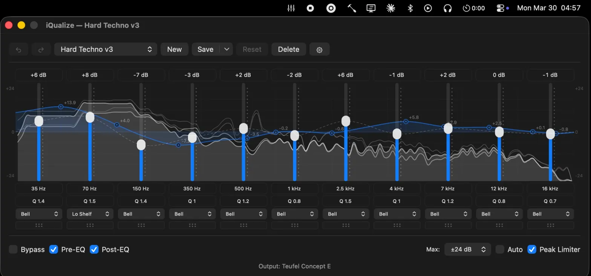

# iQualize

> macOS doesn't have a system-wide parametric EQ.
> So I built one in a day.



Built at 04:57 in Bavaria, listening to [Opera by Ballarak](https://open.spotify.com/track/6EkjiVchNqlYHoc2YNMiaV) on a Teufel Concept E 5.1.
That's the only explanation you need for why this exists.

---

## What it is

A native macOS system-wide parametric EQ with a real-time Pre/Post spectrum analyzer.
No virtual audio drivers. No Electron. No paywall.
Just Swift, CoreAudio, and a CATap doing what they should've always done.

## Why not eqMac

eqMac uses a virtual audio driver.
iQualize uses a CATap — Apple's native system audio tap introduced in macOS 14.
No driver to install. No driver to break. No driver to fight with Bluetooth.
It just works.

## Requirements

- macOS 14.2+ (Core Audio Taps API)
- Screen & System Audio Recording permission

## Install

```bash
bash install.sh          # builds, signs, installs to /Applications
open /Applications/iQualize.app
```

## Features

### Parametric EQ

- Up to 31 bands with editable frequency (20 Hz – 20 kHz), gain, and Q/bandwidth
- 7 filter types per band: Bell (parametric), Low Shelf, High Shelf, Low Pass, High Pass, Band Pass, and Notch
- Accurate biquad frequency response curve using Audio EQ Cookbook formulas, rendered as a translucent backdrop behind EQ sliders
- Per-band ghost fills, anchor dots with dB labels, and split boost/cut composite fill
- Axis labels and detailed frequency/dB grid overlay
- Catmull-Rom spline interpolation connecting slider knob positions (dashed gray line)
- Adjustable max gain range: ±6, ±12, ±18, or ±24 dB
- Dynamic peak limiter (AUPeakLimiter) — prevents digital clipping at 0 dBFS
- Smooth, glitch-free parameter updates — only changed values are written to the audio unit

### Band Management

- Add bands with + buttons on either side of the EQ — new band copies the leftmost or rightmost band
- Delete, reorder via drag-and-drop or right-click context menu (Move Left/Right)
- Minimum 1 band, maximum 31

### Presets

- Built-in presets: Flat, Bass Boost, Vocal Clarity, Loudness, Treble Boost, Podcast, Techno, Deep House, Hard Techno, Minimal, American Rap, German Rap
- Create, rename, overwrite, and delete custom presets
- Built-in presets auto-fork when edited (non-destructive)
- Unsaved changes indicator (asterisk in title)
- Import/export as `.iqpreset` JSON files with batch import and overwrite protection
- Quick switching from the menu bar or EQ window picker

#### Preset Format

Presets are `.iqpreset` files — plain JSON:

```json
{
  "bands": [
    { "bandwidth": 1.0, "filterType": "parametric", "frequency": 80, "gain": 5 },
    { "bandwidth": 1.2, "filterType": "lowShelf", "frequency": 200, "gain": -3 }
  ],
  "id": "CDE9BB8A-12A5-420C-9619-2790E20030D5",
  "isBuiltIn": false,
  "name": "My Preset"
}
```

Each band: `frequency` (Hz, 20–20000), `gain` (dB), `bandwidth` (Q factor — lower is wider, higher is narrower), `filterType` (one of `parametric`, `lowShelf`, `highShelf`, `lowPass`, `highPass`, `bandPass`, `notch` — defaults to `parametric` if omitted).

### Undo/Redo

- Full undo/redo for all EQ modifications (gain, frequency, bandwidth, reorder, add, delete)
- Slider drags coalesced into single undo actions
- Cmd+Z / Cmd+Shift+Z

### Keyboard & Scroll

- Click a band to select it (accent-colored border indicator)
- Arrow Up/Down to adjust gain (±0.5 dB per step)
- Arrow Left/Right to adjust frequency (semitone steps)
- Tab / Shift+Tab to cycle between bands
- Scroll wheel over sliders to adjust gain
- Scroll wheel over frequency/Q inputs to adjust those values
- Rapid adjustments coalesced into single undo entries

### Menu Bar

- Presets submenu with checkmarks and active preset name in parent item
- Bypass EQ toggle (Cmd+B) — pass audio through unprocessed
- Peak Limiter toggle
- Current output device display
- Open EQ window (Cmd+,)

### Spectrum Analyzer

- Dual real-time spectrum analyzer: pre-EQ (raw input) and post-EQ (processed output)
- Independent toggle checkboxes for pre-EQ and post-EQ display
- 2048-point FFT via Accelerate vDSP with Hann windowing and log-frequency binning
- Smooth Catmull-Rom spline rendering with peak hold lines
- Lock-free double-buffered audio-to-UI transfer for glitch-free 60fps updates
- Monochrome white/gray spectrum layers with z-ordered rendering; blue EQ response curve is the only colored element
- Spectrum toggle states persist across app restarts

### System Integration

- Automatic output device switching and reconnection
- Sleep/wake handling — pauses on sleep, resumes on wake
- Window state and all settings persist across launches
- Codesigned for stable TCC permissions across rebuilds
- Built with Swift Package Manager — no Xcode project needed

## Architecture

iQualize uses Core Audio Taps (CATap), introduced in macOS 14.2, to intercept system audio without a virtual audio device. Virtual devices (like BlackHole or eqMac's driver approach) create a secondary audio path — you lose system volume control, break some DRM-protected audio, and add latency. CATap captures the audio stream directly from the HAL, processes it in-process, and sends it to the output device.

```
┌─────────────────────────────────────────────────┐
│  macOS Audio Server                             │
│                                                 │
│  App Audio ──┬── Output Device (muted by tap)   │
│              │                                  │
│              └── CATap ──► iQualize IOProc      │
│                            │                    │
│                            ▼                    │
│                       Ring Buffer               │
│                            │                    │
│                            ▼                    │
│                   AVAudioSourceNode             │
│                            │                    │
│                            ▼                    │
│                    AVAudioUnitEQ                 │
│                    (parametric EQ)               │
│                            │                    │
│                            ▼                    │
│                    Output Device                 │
└─────────────────────────────────────────────────┘
```

The ring buffer decouples the real-time IOProc callback from AVAudioEngine's pull model. Parameter changes are written atomically — no locks in the audio thread, no glitches on slider drags.

## Output Handling

iQualize detects the output device's sample rate and converts internally so the audio plays back correctly regardless of what device you're on. Bluetooth sends stereo (2ch) only — SBC, AAC, and aptX all max out at 2 channels. If your speaker system supports 5.1 (e.g. Teufel Concept E via USB), the hardware handles channel routing and upmixing (Dolby Pro Logic II etc) on its end.

## Roadmap

Prioritized by impact vs effort. Score = impact (1-5) x ease (1-5). Higher = do first.

### Low-hanging fruit (score 15+)

| Feature | Impact | Ease | Score | Notes |
|---|---|---|---|---|
| Smart frequency suggestions | 3 | 5 | 15 | New bands fill the largest spectral gap instead of copying the edge band |
| ~~Keyboard shortcuts for bands~~ | ~~3~~ | ~~5~~ | ~~15~~ | ✅ Done in v0.13.0 — Arrow keys for gain/freq, Tab to cycle bands, scroll wheel on sliders/inputs |
| ~~Visual frequency response curve~~ | ~~5~~ | ~~3~~ | ~~15~~ | ✅ Done in v0.11.0 — biquad response curve with ghost fills, anchor dots, axis labels |

### High impact, moderate effort (score 10-14)

| Feature | Impact | Ease | Score | Notes |
|---|---|---|---|---|
| ~~Filter types per band~~ | ~~5~~ | ~~3~~ | ~~15~~ | ✅ Done in v0.10.0 — Bell, low/high shelf, low/high pass, notch, bandpass |
| Per-band bypass | 4 | 3 | 12 | Set individual band gain to 0 without losing saved value, toggle in UI |
| Drag-on-curve editing | 5 | 2 | 10 | Drag band nodes directly on the response curve — needs hit testing, coordinate mapping |
| ~~Real-time spectrum analyzer~~ | ~~5~~ | ~~2~~ | ~~10~~ | ✅ Done in v0.16.0 — dual pre/post-EQ FFT spectrum with Catmull-Rom splines, peak hold lines |
| ~~Peak hold markers~~ | ~~3~~ | ~~4~~ | ~~12~~ | ✅ Done in v0.16.0 — included in spectrum analyzer as peak hold spline lines |
| Filter slope selection | 3 | 4 | 12 | 6/12/24/48 dB/oct for pass filters — expose existing Core Audio param |
| Per-band solo | 3 | 3 | 9 | Mute all other bands, play only the selected band's affected range |
| Menu bar level meter | 3 | 3 | 9 | RMS/peak meter from the output buffer, render in menu bar icon |
| Sparkle auto-updates | 3 | 3 | 9 | Standard for Mac apps, one-time setup |

### Differentiators (score 5-9, higher effort but competitive moat)

| Feature | Impact | Ease | Score | Notes |
|---|---|---|---|---|
| Per-app volume mixer | 5 | 2 | 10 | Independent volume per app. Requires per-process audio taps — significant Core Audio work |
| Per-app EQ routing | 5 | 1 | 5 | Different EQ per app. Same tap challenge as above but with per-stream EQ instances |
| AutoEQ headphone profiles | 5 | 2 | 10 | Import from the open-source AutoEQ database. Match headphone model, apply corrective curve |
| Preset sharing / community | 4 | 2 | 8 | Web directory or GitHub repo of .iqpreset files, in-app browse and import |
| Mid/Side processing | 4 | 2 | 8 | Encode L/R to Mid/Side, EQ independently, decode back. Matrix math in the audio buffer |
| L/R independent EQ | 3 | 3 | 9 | Separate curves per channel — simpler than Mid/Side, just duplicate the EQ chain |
| Shortcuts integration | 3 | 3 | 9 | macOS Shortcuts actions for preset switching, bypass toggle — good for automation |

### Moonshots (high effort, high reward)

| Feature | Impact | Ease | Score | Notes |
|---|---|---|---|---|
| Audiogram hearing compensation | 5 | 1 | 5 | Built-in hearing test (play tones, user marks threshold), generate corrective L/R curve. Nobody does this well on macOS — huge accessibility angle, press-worthy |
| Room correction via mic | 5 | 1 | 5 | Play test tones through speakers, record with Mac mic, compute room response, generate inverse EQ. Pro studio feature at consumer level |
| AU plugin hosting | 5 | 1 | 5 | Load third-party Audio Unit effects into the signal chain. Opens the entire AU plugin ecosystem |
| Dynamic EQ | 4 | 1 | 4 | Bands activate based on signal threshold — compressor married to EQ. Requires sidechain analysis per band |
| Linear phase mode | 3 | 1 | 3 | FIR filter implementation, preserves phase coherence. High latency, mastering use case |
| Auto-gain compensation | 3 | 2 | 6 | Maintain perceived loudness while EQ changes. Integrate over frequency-weighted gain |
| Multichannel-aware EQ | 4 | 1 | 4 | Per-channel or per-group curves for 5.1/7.1 setups. Needs channel routing UI |

---

I build tools that shouldn't need to exist.

[darius.codes](https://darius.codes)
